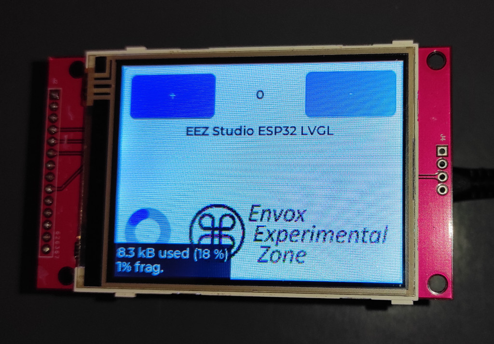

# ESP32 lvgl eez-demo

## Highly experimental branch

https://github.com/lvgl/lvgl

https://github.com/lvgl/lv_port_esp32

https://github.com/eez-open/eez-framework

https://github.com/eez-open/studio

### Using this repo


if you do not have ESP IDF check here how to install
You can use v4.4.3 

https://docs.espressif.com/projects/esp-idf/en/stable/esp32/get-started/#linux-and-macos

Go inside you ESP IDF instalation folder and run 

```
. export.sh
```

Now go to folder where you want this priject to be and clone this repo

```
git clone --recurse-submodules https://github.com/goran-mahovlic/esp32-lvgl-eez-demo.git
```

Go to the newly created folder

```
cd esp32-lvgl-eez-demo
```

Copy CMakeLists to CalEPD folder
cp config/CalEPD_CMakeLists.txt components/CalEPD/CMakeLists.txt 
or you can also run prepare.sh

```
chmod +x prepare.sh
./prepare.sh
```

Run build and flash for inkplate 6 as this is set as current default

Make sure you inkplate is connected and powered on

```
idf.py build; idf.py -p /dev/ttyUSB0 flash monitor
```

### Example EEZ GUI with ESP32 using LVGL



### LVGL project for ESP32 with EEZ studio demo

EEZ demo project is located in eez-project directory - you can open that file with EEZ Studio

- Version of ESP-IDF required 4.2. NOTE: We're trying to make this repo backwards compatible, usage of idf.py is encouraged.
- Version of LVGL used: 8.3.
- Version of lv_examples used: 8.3.

#### Table of content
- [Get started](#get-started)
- [Use LVGL in your ESP-IDF project](#use-lvgl-in-your-esp-idf-project)
- [Use lvgl_esp32_drivers in your project](#use-lvgl_esp32_drivers-in-your-project)
- [Platformio support](#platformio-support)
- [ESP32-S2 Support](#esp32-s2-support)

## Display and touch controllers

The display and touch (indev) controllers are now into it's own repository, you can find it [here](https://github.com/lvgl/lvgl_esp32_drivers).
To report any issue or add new display or touch (indev) drivers you can do so in the `lvgl_esp32_drivers` repo.

## Get started

### Prerequisites

- ESP-IDF Framework.

### Note

This project tries to be compatible with both the ESP-IDF v3.x and v4.0, but using v4.0 is recommended.
Instructions assume you are using the v4.x toolchain, otherwise use the make commands, e.g. instead of running `idf.py menuconfig`, run `make menuconfig`.

### Build and run the demo.

1. Clone this project by `git clone --recurse-submodules https://github.com/goran-mahovlic/esp32-lvgl-eez-demo.git`, this will pull this repo and its submodules.

2. Get into the created `esp32-lvgl-eez-demo` directory.

3. Run `idf.py menuconfig`

4. Configure LVGL in `Components config->LVGL Configuration`. For monochrome displays use the mono theme and we suggest enabling the `unscii 8` font.

5. Configure your display and/or touch controllers in `Components config->LVGL TFT Display Configuration` and `Components config->LVGL TOUCH Configuration`.

6. Store your project configuration.

7. Build the project with `idf.py build`

8. If the build don't throw any errors, flash the demo with `idf.py -p (YOUR SERIAL PORT) flash` (with `make` this is just `make flash` - in 3.x PORT is configured in `menuconfig`)

## Platformio support

### Not tested on this fork - let me know if it works

Using the [lv_platformio](https://github.com/lvgl/lv_platformio) project add the following lines to `platformio.ini` file:

```
[env:esp32]
platform = espressif32
framework = espidf
board = esp-wrover-kit
```

Change the default environment to `default_envs = esp32`.

Modify the `main.c` like this:

```c
#include "lvgl.h"

// #include "driver.h"

#include "demo.h"

int app_main(void)
{
    lv_init();

    /* Initialize your hardware. */
    
    /* hw_init(); */

    demo_create();

    /* Create the UI or start a task for it.
     * In the end, don't forget to call `lv_task_handler` in a loop. */

    /* hw_loop(); */

    return 0;
}
```

For more information see: [platformio with espidf framework compability](https://github.com/lvgl/lv_port_esp32/issues/168).

# ESP32-S2 Support

Support for ESP32-S2 variant is Work In Progress.
Smaller displays (e.g. 320x240) work fine, but larger ones need testing.

## Background

ESP32-S2 has less on-chip SRAM than its predecessor ESP32 (520kB vs. 320kB).
This causes problems with memory allocation with large LVGL display buffers as they don't fit into the on-chip memory
and external PSRAM is not accessible by DMA.

Moreover, static allocation to external PSRAM is not yet supported
(see [GitHub issue](https://github.com/espressif/esp-idf/issues/6162)).

At this momement, the buffers are dynamicaly allocated with DMA capabilty and memory allocator handles the rest.
